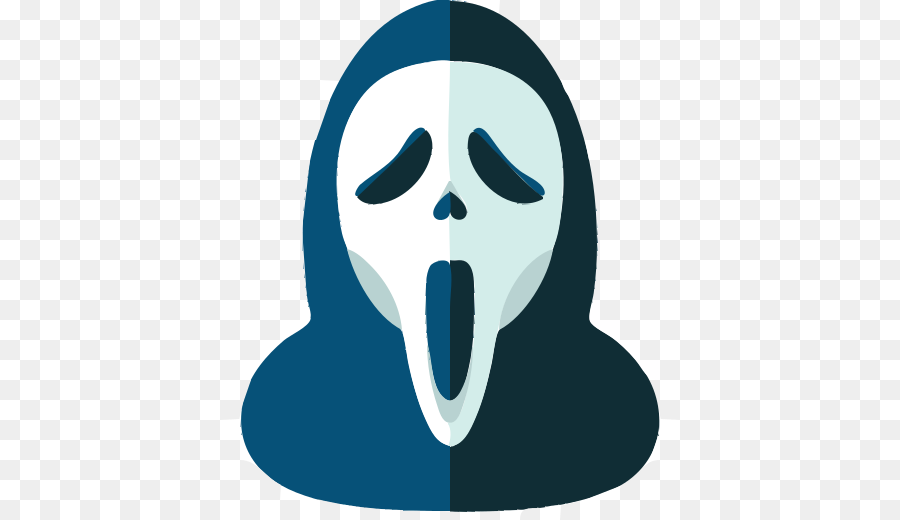

<p align="center">    </p>

<h1 align="center">Hi there, I'm <a href="https://umar0x01.sh"  target="_blank">Umar!</a> 👋</h1>
    
<h3 align="center">An enthusiastic programmer and pentester who loves to explore, automate, break, learn, and hack all things!</h3>
<p align="left">  </p>

```python3
import os

def greet():
    print(f"Welcome {os.popen('whoami').read().strip()}!! 👋")
```

<p align="center">  </p>


<p align="center"> 
<a href="https://www.sans.eu.org" target="blank"></a>
<a href="https://www.sans.eu.org" target="blank"></a>    
</p>
